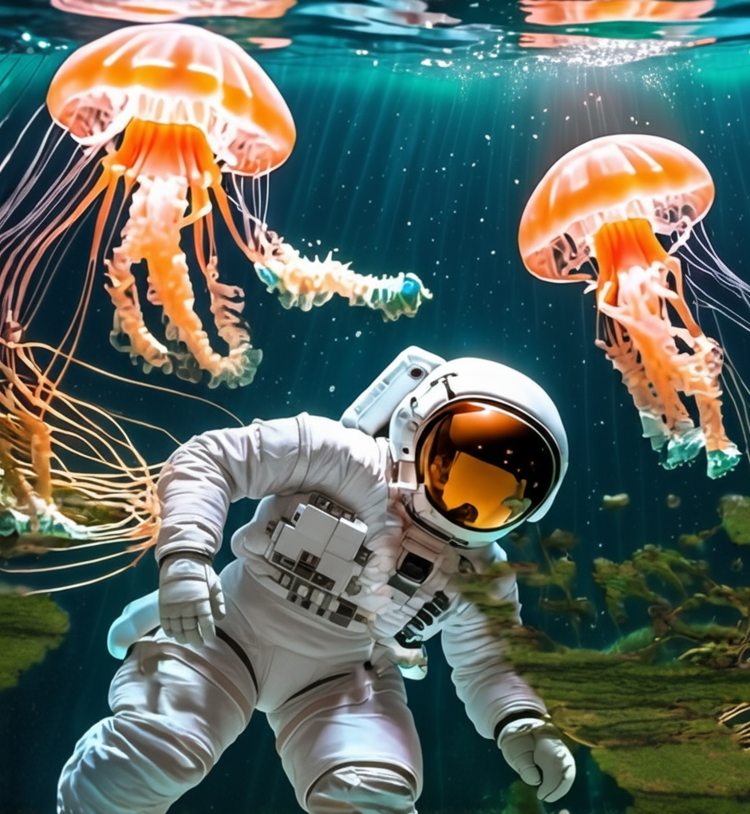
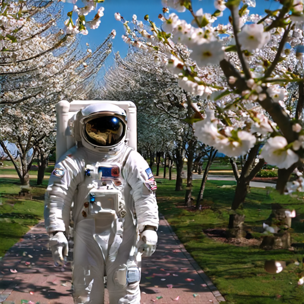
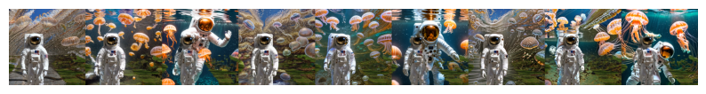
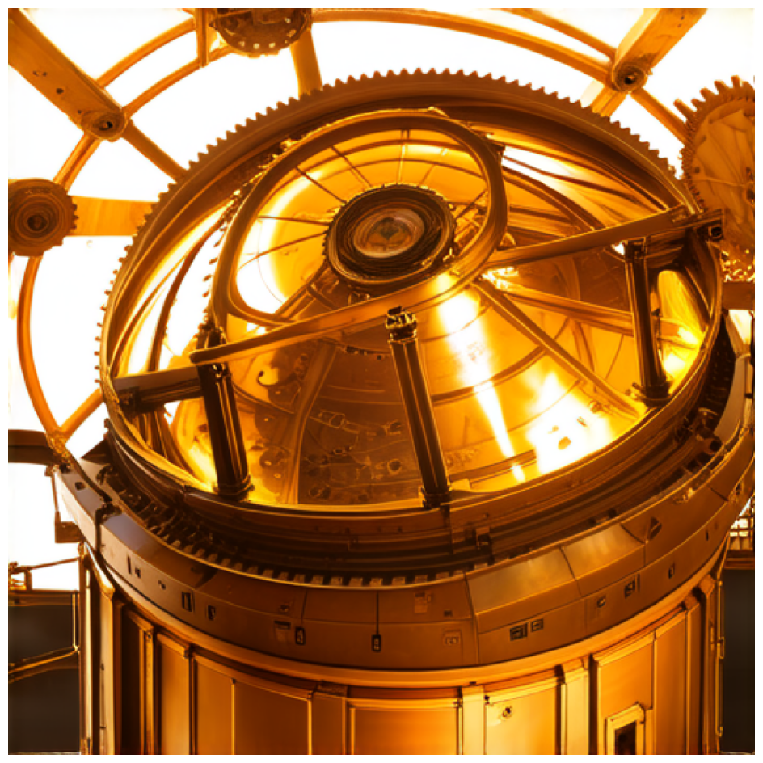
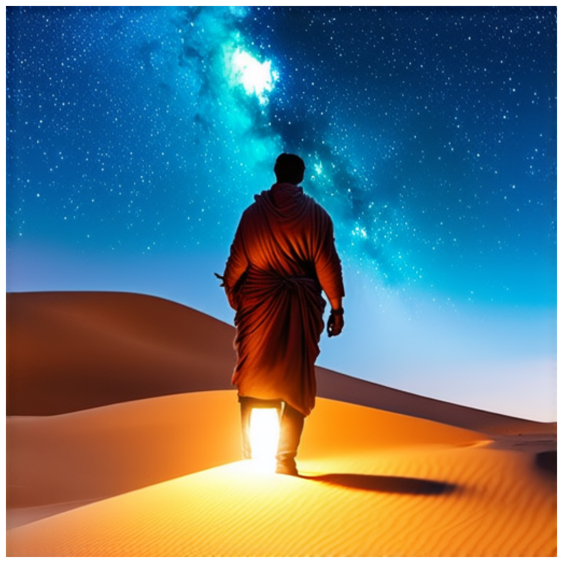
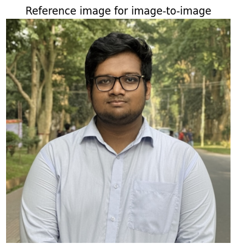
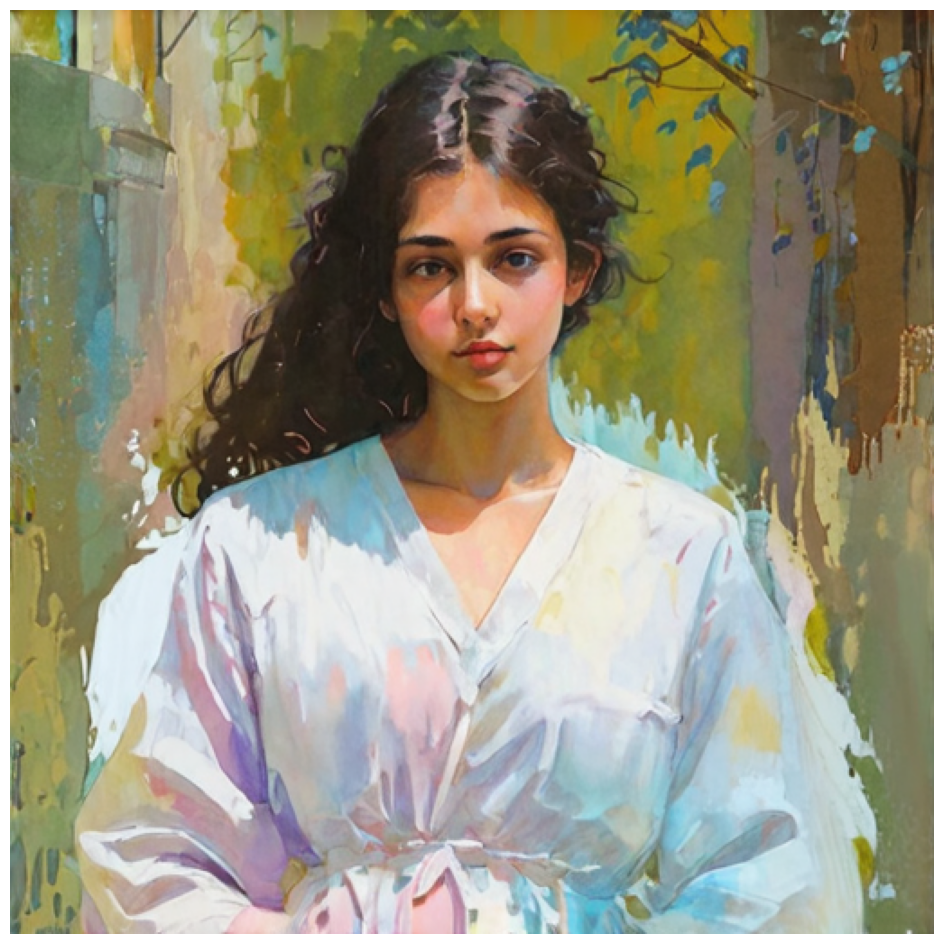
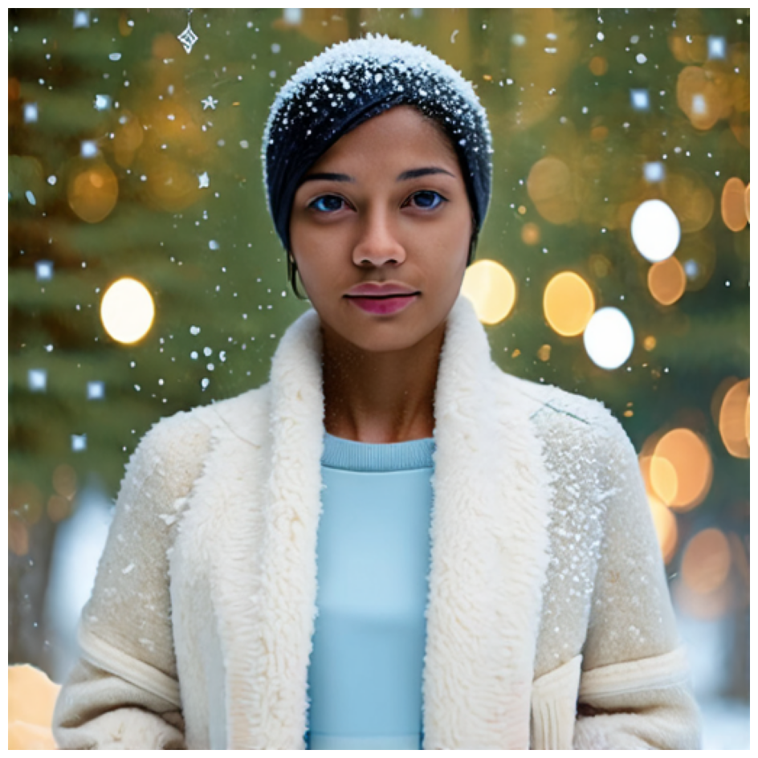

# Stable Diffusion 3 Inpainting, Text-to-Image, and Image-to-Image Generation in Keras Hub

This repository contains the implementation and experiments for Assignment 14, exploring **Stable Diffusion 3 (SD3)** via **Keras Hub**.  
The work focuses on three core capabilities:

1. **End-to-end inpainting** using SD3 Inpaint model  
2. **Prompt flexibility analysis** (how much the output changes when only the prompt varies)  
3. **Text-to-image (T2I)** and **image-to-image (I2I)** generation

All experiments were run on an **RTX 4090 GPU** (TensorFlow backend).

---

## 🚀 Example Inpaint Input


---

## 🔧 Tasks Covered

- Using **Stable Diffusion 3 Inpainting** from Keras Hub  
  👉 https://keras.io/keras_hub/api/models/stable_diffusion_3/stable_diffusion_3_inpaint/

- Investigating the effect of:
  - 📝 Prompt wording  
  - 🎛 Guidance scale  
  - 🌀 Strength (noise level)

- Running **Image-to-Image** & **Text-to-Image** generation  
  👉 https://keras.io/keras_hub/guides/stable_diffusion_3_in_keras_hub/

---

## 📘 Code Availability

### 🔹 Inpainting + Prompt Flexibility Notebook  
👉 **[Click to open Inpainting Code](https://colab.research.google.com/drive/1EAMp3BEaoMqgIIuyQWwDQ5vJ1wxTUbGa?usp=sharing)**

### 🔹 Text-to-Image + Image-to-Image Notebook  
👉 **[Click to open T2I & I2I Code](https://colab.research.google.com/drive/1P5UbNPv4bJ4VLns5IHdMf4nNPJAkFrQE?usp=sharing)**

---

## 🧠 Methodology Summary

### ⚙️ Environment
- GPU: **NVIDIA RTX 4090**
- Resolution: **512×512**
- Precision: **float16**
- Backend: **TensorFlow + Keras Hub**

### 🛠 Models Used
- `StableDiffusion3Backbone`
- `StableDiffusion3Inpaint`
- `StableDiffusion3TextToImage`
- `StableDiffusion3ImageToImage`

---

## 🖼️ Inpainting Examples

### 🌊 Underwater Astronaut


### 🌸 Cherry Blossom Astronaut


---

## 🧩 Prompt Flexibility Grid



This grid shows how **strength (rows)** and **guidance scale (columns)** change the inpainting behavior.  
Higher strength = more aggressive editing  
Higher guidance = stronger prompt following

---

## 🤖 Robot Inpainting

<table>
<tr>
<td></td>
<td></td>
</tr>

<tr>
<td align="center"><b>Input Robot Sketch</b></td>
<td align="center"><b>Inpainted Robotic Bulldog</b></td>
</tr>
</table>

---

## 🎨 Text-to-Image Results (T2I)

<table>
<tr>
<td></td>
<td></td>
<td></td>
</tr>

<tr>
<td align="center"><b>Cyberpunk Samurai</b></td>
<td align="center"><b>Steampunk Observatory</b></td>
<td align="center"><b>Desert Nomad</b></td>
</tr>
</table>

---

## 🎭 Image-to-Image Stylization (I2I)

<table>
<tr>
<td></td>
<td></td>
<td></td>
<td></td>
</tr>

<tr>
<td align="center"><b>Reference Image</b></td>
<td align="center"><b>Cyberpunk</b></td>
<td align="center"><b>Watercolor</b></td>
<td align="center"><b>Winter Scene</b></td>
</tr>
</table>

---
# 📚 Citation

If you use this repository, any code snippet, or take help from the explanations, **please cite**:

```bibtex
@misc{ameen2025detectingaigeneratedimagesdiffusion,
      title={Detecting AI-Generated Images via Diffusion Snap-Back Reconstruction: A Forensic Approach}, 
      author={Mohd Ruhul Ameen and Akif Islam},
      year={2025},
      eprint={2511.00352},
      archivePrefix={arXiv},
      primaryClass={cs.CV},
      url={https://arxiv.org/abs/2511.00352}, 
}


---
# 📚 Citation

If you use this repository, any code snippet, or take help from the explanations, **please cite**:

```bibtex
@misc{ameen2025detectingaigeneratedimagesdiffusion,
      title={Detecting AI-Generated Images via Diffusion Snap-Back Reconstruction: A Forensic Approach}, 
      author={Mohd Ruhul Ameen and Akif Islam},
      year={2025},
      eprint={2511.00352},
      archivePrefix={arXiv},
      primaryClass={cs.CV},
      url={https://arxiv.org/abs/2511.00352}, 
}
